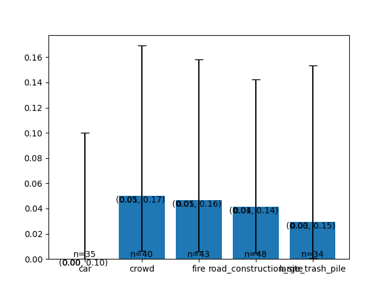
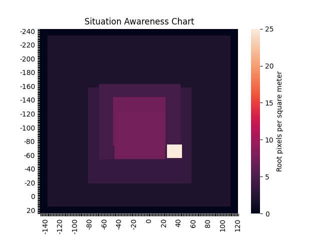
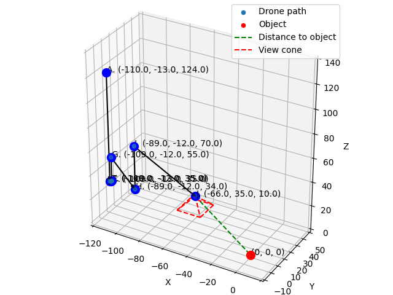

# Result analysis

Alright, you've run FlySearch on model of your choice. You are probably interested in actually analysing your model's performance. This tutorial part is meant to help you with doing that.

## Artifacts overview

 By this point, you should have a log folder that looks like this:
```
you_run_name
└───0
│   │   agent_info.json
│   │   conversation.json
│   │   scenario_params.json
│   │   simple_conversation.json
│   │   0.png
│   │   1.png
│   │   2.png
│   │   ...
│   │   0_coords.txt
│   │   1_coords.txt
│   │   2_coords.txt
│   │   ...
│   │   object_bbox.txt
│   │   termination.txt
│   
└───1
│   │   agent_info.json
│   │   conversation.json
│   │   scenario_params.json
│   │   simple_conversation.json
│   │   0.png
│   │   1.png
│   │   2.png
│   │   ...
│   │   0_coords.txt
│   │   1_coords.txt
│   │   2_coords.txt
│   │   ...
│   │   object_bbox.txt
│   │   termination.txt
│   
...
```

Each of these subfolders is a folder containing information about a singular trajectory. Saved images are enumerated images sent to the drone, while files with coordinates indicate agent's position _relative to the object being searched_. For example, if you see coordinates like `(0, 0, 100)` you know that the agent is directly above the target at 100 meters altitude. There is also a `scenario_params.json` which describes the scenario configuration and allows a replication of a trajectory via mimicking (see examples at `examples/mimic.sh` and documentation in `README.md` and `tutorials/00-script.md`). There are also `conversation.json` and `simple_conversation.json` showcasing agent's interactions with benchmark.

There is also `agent_info.json` where custom agents may save their internal state. However, if you were using the `simple_llm` agent, this file can be safely ignored.

## Generating a TeX document with trajectories

In the Appendix H of our [paper](https://arxiv.org/abs/2506.02896v2) we include example trajectories recorded in our benchmark. These allow to help researchers visually understand _how_ models are interacting with the environment in a way that pure numbers cannot convey that well. This subsection is meant to guide you through creating such a visualisation on your own.

To do it, locate the `analysis/report_generation/generate_appendix.py` file. It contains a `generate_report` function that we recommend using to create such a visualisation. 

Let's assume that you want to generate a report for model XYZ on FS-2 and that the run directory is `all_logs/XYZ-FS2`. You can then generate a TeX code for the run running a code like this:

```python 
with open("XYZ-FS2.tex", "w") as f:
    generate_report(
        model_displayname="XYZ",
        path_dir=pathlib.Path("../../all_logs/"),
        filter_func=lambda x: True,
        file=f,
        startfrom=0,
        n=200,
        subdir="XYZ-FS2",
        overwrite=True
    )
```

It will save the relevant TeX code to `XYZ-FS2.tex` and relevant images (figures and images that were sent to the agent) to `images/XYZ-FS2`. You can use it to add to your own TeX paper. If you _just_ want to have a standalone report, you can use an example TeX `main` file (`main.tex`). It looks like this:

```tex
\documentclass[12pt, a4paper]{report}

\usepackage[margin=0.8in]{geometry}
\usepackage{dramatist}
\usepackage{graphicx}
\usepackage{enumitem}
\usepackage{parskip}

\usepackage{setspace}
\onehalfspacing

\setcounter{secnumdepth}{3}

\begin{document}

\tableofcontents

\chapter{Examples}

\input{XYZ-FS2}

\end{document}
```

Note that you will need to change the name of the argument passed to the `\input` command to match name of the `.tex` file you've generated.

You can then compile the document by doing:

```bash 
set -e
pdflatex -interaction=nonstopmode -file-line-error -shell-escape --output-directory=build main.tex
pdflatex -interaction=nonstopmode -file-line-error -shell-escape --output-directory=build main.tex
```

or using premade script for that task (`compile.sh`):

```bash 
./compile.sh main
```

the compilation result should be stored in the `build/main.pdf` file.

## Calculating success rates 

Being able to see trajectories directly, but analysing them at larger scales "by hand" is (obviously) impractical. As such, we offer premade classes meant to simplify the large-scale data analysis process for you.

### `Run` class

The `Run` class is located in `analysis/run.py` file. It's only argument is a path to a specific **trajectory** (e.g. `all_logs/your_run_name/5`) and it's main purpose is to parse contents of the trajectory directory to represent them in an easy-to-use object. 

_Sidenote_: Note that in this documentation we tend to differentiate between _trajectories_ (i.e. single, independent agent flights) and _runs_ (multiple trajectories). However, in code the `Run` class represents -- as stated before -- a trajectory. This doesn't really matter, but we inform about it to avoid unnecessary confusion.

Here is a simple example on how to use it (by accessing some of its properties):

```python 
import pathlib

from analysis import Run

def main():
    run = Run(pathlib.Path("all_logs/GPT4o-FS2-City-Reckless1/5"))

    print(run.start_position) # (-49.0, 25.0, 101.0)
    print(run.object_type) # RED_SPORT_CAR
    print(run.end_position) # (-150.0, -59.0, 6.0)
    print(run.model_claimed) # True

    print(run.get_comments()[0][:50]) # <Reasoning>There is a red car visible at the top l
    print(run.get_object_bbox()) # (-67375.53, 36284.47, 57.88, -67026.71, 36755.36, 195.4)
    print(run.forest_level) # False

    # And so on

if __name__ == "__main__":
    main()
```

You can also load all trajectories at once with help of the `load_all_runs_from_a_dir` function:

```python 
import pathlib

from analysis import load_all_runs_from_a_dir

def main():
    trajectories = load_all_runs_from_a_dir(pathlib.Path("all_logs/GPT4o-FS2-City-Reckless1"))
    run = trajectories[5]

    print(run.start_position) # (-49.0, 25.0, 101.0)
    print(run.object_type) # RED_SPORT_CAR
    print(run.end_position) # (-150.0, -59.0, 6.0)
    print(run.model_claimed) # True

    print(run.get_comments()[0][:50]) # <Reasoning>There is a red car visible at the top l
    print(run.get_object_bbox()) # (-67375.53, 36284.47, 57.88, -67026.71, 36755.36, 195.4)
    print(run.forest_level) # False

    # And so on

if __name__ == "__main__":
    main()
```

### `RunAnalyser` class 

The main task of the `RunAnalyser` class is to check whether the success criterion was fulfilled. 

```python
import pathlib

from analysis import load_all_runs_from_a_dir, RunAnalyser

def main():
    trajectories = load_all_runs_from_a_dir(pathlib.Path("all_logs/GPT4o-FS2-City-Reckless1"))
    run = trajectories[5]

    analyser = RunAnalyser(run)
    print(analyser.success_criterion_satisfied(threshold=10, check_claimed=True)) # False
    
    # Note that we don't use Euclidean distance in our success criterion,
    # but RunAnalyser allows you to calculate it
    print(analyser.get_euclidean_distance()) # 161.2978...

if __name__ == "__main__":
    main()
```

### `CriterionPlotter` class 

This class takes in a list of `Run`s as an argument and can aggregate the results for you. We describe a few of its methods below. 

#### `aggregate_runs_per_function` method

The signature of this method is: `def aggregate_runs_per_function(self, fun: Callable, fil: Optional[Callable] = None):`

And it returns dictionaries that look like this:

```python
{
    "car": [run_a1, run_a2, ..., run_an]
    "crowd": [run_b1, run_b2, ..., run_bm]
    ...
}
```
It is the first step when we are performing analysis of success rate per specific object classes (for example, when we want to see whether it's easier to search for a car or for a crowd).

The first argument (`fun`) is a function that takes a `Run` as an argument and returns an object by which an aggregation should happen. For example, when we were aggregating results for the FlySearch paper in the city environment, we used an aggregation function like this:

```python
def city_aggregation_function(run: Run):
    object_type = str(run.object_type).lower()

    if "car" in object_type:
        return "car"
    elif "pickup" in object_type:
        return "car"
    elif "truck" in object_type:
        return "car"
    return object_type
```

in order to merge all cars, pickups and trucks into one `"car"` class.

```python
import pathlib
import json

from analysis import load_all_runs_from_a_dir, RunAnalyser, Run, CriterionPlotter

def main():
    trajectories = load_all_runs_from_a_dir(pathlib.Path("all_logs/GPT4o-FS2-City-Reckless1"))
    plotter = CriterionPlotter(trajectories)

    def city_aggregation_function(run: Run):
        object_type = str(run.object_type).lower()

        if "car" in object_type:
            return "car"
        elif "pickup" in object_type:
            return "car"
        elif "truck" in object_type:
            return "car"
        return object_type

    runs_aggregated_per_type = plotter.aggregate_runs_per_function(city_aggregation_function)

    print(runs_aggregated_per_type.keys()) # dict_keys(['car', 'crowd', 'fire', 'road_construction_site', 'large_trash_pile'])
    print(runs_aggregated_per_type["car"][0]) # analysis.run.Run object

if __name__ == "__main__":
    main()
```

By itself, this function is not that useful -- but it becomes extremely useful when combined with the next method.

(Note: the second argument, `fil` is not that useful -- it's a function that takes in `Run` as an argument and returns a boolean -- if it's `False` then the run should be excluded from the analysis. By default, the value of this argument is `None`, which means that this function is `lambda x: True` -- i.e. no trajectories will be discarded.)

#### `plot_accuracy_in_aggregated_runs` method 

The signature of this method is

`def plot_accuracy_in_aggregated_runs(self, variable_to_runs: Dict, ax, success_criterion: Callable | None = None, threshold=10) -> Dict:`

The first argument is the dictionary returned by the function above. For each of the dictionary values, success rates will be calculated _independently_, allowing you to get per-class success rates. The second argument is matplotlib ax, allowing you to visualise the results. The third argument allows you to customise your success criterion, which (by default) assumes 10 meter threshold and requires reporting of `FOUND`.

This function modifies the matplotlib `ax` and returns a dictionary with success rate statistics per aggregation class. Let's see an example:

```python
import pathlib
import json

from matplotlib import pyplot as plt

from analysis import load_all_runs_from_a_dir, RunAnalyser, Run, CriterionPlotter

def main():
    trajectories = load_all_runs_from_a_dir(pathlib.Path("all_logs/GPT4o-FS2-City-Reckless1"))
    plotter = CriterionPlotter(trajectories)

    def city_aggregation_function(run: Run):
        object_type = str(run.object_type).lower()

        if "car" in object_type:
            return "car"
        elif "pickup" in object_type:
            return "car"
        elif "truck" in object_type:
            return "car"
        return object_type

    runs_aggregated_per_type = plotter.aggregate_runs_per_function(city_aggregation_function)

    fig, ax = plt.subplots(nrows=1) # We will ignore it for now
    stats = plotter.plot_accuracy_in_aggregated_runs(
        runs_aggregated_per_type,
        ax,
        success_criterion=lambda run: RunAnalyser(run).success_criterion_satisfied(threshold=10, check_claimed=True)
        # ^ We don't have to specify it in this case, since it will be done this way by default
        # To get unclaimed stats, flip `check_claimed` to False
    )

    print(json.dumps(stats, indent=4))

if __name__ == "__main__":
    main()
```

This code will print:

```json
{
    "car": {
        "mean": 0.0,
        "std": 0.0,
        "sem": 0.0,
        "conf_int": [
            0.0,
            0.1
        ],
        "n": 35,
        "total_successes": 0
    },
    "crowd": {
        "mean": 0.05,
        "std": 0.2179,
        "sem": 0.03489912202260563,
        "conf_int": [
            0.0061,
            0.1692
        ],
        "n": 40,
        "total_successes": 2
    },
    "fire": {
        "mean": 0.0465,
        "std": 0.2106,
        "sem": 0.03249479679096614,
        "conf_int": [
            0.0057,
            0.1581
        ],
        "n": 43,
        "total_successes": 2
    },
    "road_construction_site": {
        "mean": 0.0417,
        "std": 0.1998,
        "sem": 0.02914766351555603,
        "conf_int": [
            0.0051,
            0.1425
        ],
        "n": 48,
        "total_successes": 2
    },
    "large_trash_pile": {
        "mean": 0.0294,
        "std": 0.169,
        "sem": 0.02941176470588235,
        "conf_int": [
            0.0007,
            0.1533
        ],
        "n": 34,
        "total_successes": 1
    }
}
```

What if you just want to see one general success rate, without dividing it by class? Well, you can just aggregate it differently -- for example like this:

```python
runs_unaggregated = plotter.aggregate_runs_per_function(
        lambda x: "unaggregated")
```

This would yield:

```json
{
    "unaggregated": {
        "mean": 0.035,
        "std": 0.1838,
        "sem": 0.013027801736688053,
        "conf_int": [
            0.0142,
            0.0708
        ],
        "n": 200,
        "total_successes": 7
    }
}
```

As stated before, you can also view a matplotlib plot. They don't look great, but they may serve as a perhaps-useful ad-hoc visualisation tool.



Note: The confidence intervals provided are 95% confidence intervals.

#### `get_runs_aggregated_per_height_bin` method

This function is a utility method that uses previously discussed `aggregate_runs_per_function` method to aggregate runs by their starting height. This is useful when analysing model's performance relative to "hardness" of a given scenario (as the higher starting points tend to be more problematic -- the higher you are, the smaller is the object you are looking for).

For example this:

```python
    trajectories = load_all_runs_from_a_dir(pathlib.Path("all_logs/GPT4o-CityNew"))
    plotter = CriterionPlotter(trajectories)

    runs_aggregated_per_height = plotter.get_runs_aggregated_per_height_bin()

    fig, ax = plt.subplots(nrows=1)
    stats = plotter.plot_accuracy_in_aggregated_runs(
        runs_aggregated_per_height,
        ax,
        success_criterion=lambda run: RunAnalyser(run).success_criterion_satisfied(threshold=10, check_claimed=True)
    )

    print(json.dumps(stats, indent=4))
```

would give you:

```json
{
    "30 - 40": {
        "mean": 0.6731,
        "std": 0.4691,
        "sem": 0.06568558183307435,
        "conf_int": [
            0.5289,
            0.7967
        ],
        "n": 52,
        "total_successes": 35
    },
    "40 - 50": {
        "mean": 0.4324,
        "std": 0.4954,
        "sem": 0.08256893144064578,
        "conf_int": [
            0.271,
            0.6051
        ],
        "n": 37,
        "total_successes": 16
    },
    "50 - 60": {
        "mean": 0.2609,
        "std": 0.4391,
        "sem": 0.06545849153992007,
        "conf_int": [
            0.1427,
            0.4113
        ],
        "n": 46,
        "total_successes": 12
    },
    "60 - 70": {
        "mean": 0.2,
        "std": 0.4,
        "sem": 0.06405126152203486,
        "conf_int": [
            0.0905,
            0.3565
        ],
        "n": 40,
        "total_successes": 8
    },
    "70 - 80": {
        "mean": 0.102,
        "std": 0.3027,
        "sem": 0.043691267274371184,
        "conf_int": [
            0.034,
            0.2223
        ],
        "n": 49,
        "total_successes": 5
    },
    "80 - 90": {
        "mean": 0.1,
        "std": 0.3,
        "sem": 0.048038446141526144,
        "conf_int": [
            0.0279,
            0.2366
        ],
        "n": 40,
        "total_successes": 4
    },
    "90 - 100": {
        "mean": 0.0571,
        "std": 0.2321,
        "sem": 0.039807459772527774,
        "conf_int": [
            0.007,
            0.1916
        ],
        "n": 35,
        "total_successes": 2
    },
    "100 - 110": {
        "mean": 0.0,
        "std": 0.0,
        "sem": 0.0,
        "conf_int": [
            0.0,
            0.975
        ],
        "n": 1,
        "total_successes": 0
    }
}
```

## Cool charts you can make

You may have noticed that our per-trajectory reports contain charts that are meant to visualise how the trajectory "went". If you'd like to make one yourself, this section is for you.

In short, to make them you need to use the `RunVisualiser` class located in the `analysis/run_visualiser.py` file. Thankfully, it's pretty straightforward to use:

```python
import pathlib

from matplotlib import pyplot as plt
from mpl_toolkits.mplot3d import Axes3D

from analysis import load_all_runs_from_a_dir, RunVisualiser

def main():
    trajectories = load_all_runs_from_a_dir(pathlib.Path("all_logs/Gemma27b-FS2"))
    run = trajectories[0]

    visualiser = RunVisualiser(run)

    fig, ax = plt.subplots()
    visualiser.plot_situation_awareness_chart(ax)

    plt.show()

    fig = plt.figure()
    ax = Axes3D(fig)
    fig.add_axes(ax)

    visualiser.plot(ax)
    plt.show()

if __name__ == "__main__":
    main()
```

This will generate following charts:





This concludes this part of our tutorial. If you would like to see more examples, you can check out different scripts in `analysis/` directory. Those are scripts that we've used -- they may or may not be useful to you.
